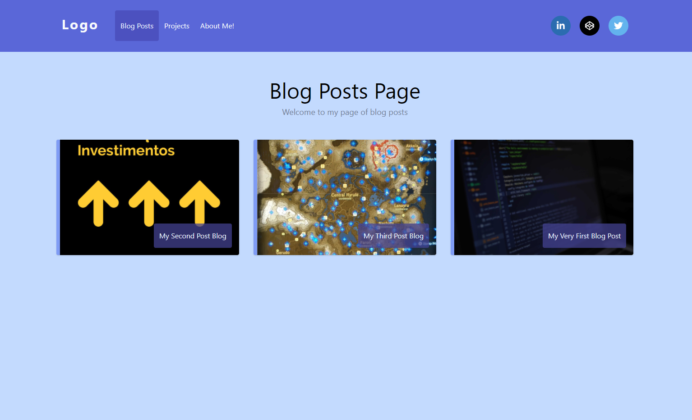

# Website With React JS & Sanity.io

Blog criado utilizando as tecnologias React JS e Sanity.io com o objetivo de adquirir conhecimento sobre a plataforma de conteúdo [Sanity](https://www.sanity.io/)

<br>




<br>

## Tecnologias

Tecnologia | Descrição | Versão | Site
------------ | ------------- | ------------ | ------------
React JS | Uma biblioteca JavaScript para criar interfaces de usuário | v16.13.0 | https://pt-br.reactjs.org/
React Router DOM | DOM bindings for React Router | v5.2.0 | https://yarnpkg.com/package/react-router-dom
React Icons | Include popular icons in your React projects easily with react-icons | v4.2.0 | https://react-icons.github.io/react-icons/
Sanity/CLI| Sanity CLI tool for managing Sanity installations, managing plugins, schemas and datasets | v2.10.5 | https://yarnpkg.com/package/@sanity/cli
Sanity/Client | Client for retrieving data from Sanity | v2.10.5 | https://yarnpkg.com/package/@sanity/client
Sanity/Image-url | Quickly generate image urls from Sanity image records | 0.140.22 | https://www.sanity.io/docs/image-url
Sanity/block-content-to-react | Render an array of block text from Sanity with React or React Native. | 3.0.0 | https://yarnpkg.com/package/@sanity/block-content-to-react

<br>

## Preview Demo

https://website-reactjs-sanity-io.vercel.app/

<br>

## React Project

### Install dependencies

```
yarn install
```
or 
```
npm install
```

### Initialize

```
yarn start
```

<br>


## Sanity

### Install Sanity CLI

```
npm install -g @sanity/cli
```
or

```
yarn global add @sanity/cli
```

<br>

### Initialize Sanity

```
sanity init
```

- Log in or create a new account (select your option)<br>
? Login type GitHub <br>
- login successful <br>
? Project name (Insert your Project Name) <br>
? Use the default dataset configuration? Yes     (Y/n) <br>
✔ Creating dataset <br>
? Project output path: (Choose your output path) example: users\Robson\Github\Project\Studio (escolha uma pasta para o projeto) <br>
? Select project template (Choose your project Type) example: Blog (Schema) <br>
✔ Bootstrapping files from template <br>
✔ Resolving latest module versions <br>
✔ Creating default project files <br>

✔ Saved lockfile

Success! 

<br>

## Sanity options

+ [**sanity docs**](https://www.sanity.io/docs/sanity-studio) (to open the documentation in a browser)
+ **sanity manage** (to open the project settings in a browser)
+ **sanity help** (to explore the CLI manual)
+ **sanity start** (to run your project-name) (entre dentro da pasta criada do projeto sanity)
+ **sanity deploy** (to deploy your data) 
